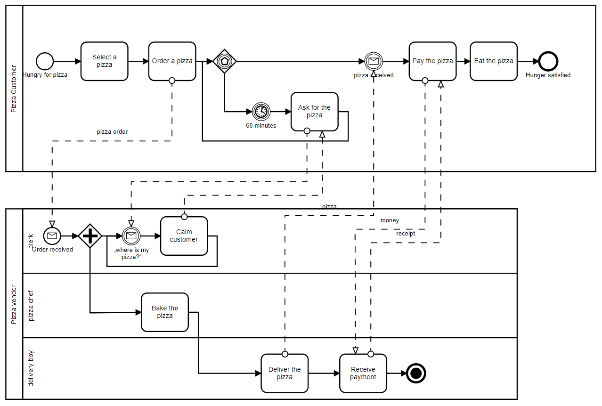

# bpmn-js bundling example

This example showcases how add and bundle [bpmn-js](https://github.com/bpmn-io/bpmn-js)
along with a node-style web application using [Webpack](https://webpack.js.org).


## About

This example uses bpmn-js to embed the [pizza collaboration](http://demo.bpmn.io/s/pizza-collaboration) diagram into a web application.




## Usage Summary

Install bpmn-js via [npm](http://npmjs.org)

```
npm install --save bpmn-js
```

Use it in your application

```javascript
import BpmnViewer from 'bpmn-js';

var viewer = new BpmnViewer({
  container: '#canvas'
});

viewer.importXML(pizzaDiagram, function(err) {

  if (!err) {
    console.log('success!');
    viewer.get('canvas').zoom('fit-viewport');
  } else {
    console.log('something went wrong:', err);
  }
});
```

Bundle the `src/app.js` file for the browser with Webpack:

```
webpack ./src/app.js -o public/app.bundled.js --mode development
```

To learn about more bundling options, checkout the [webpack-cli documentation](https://webpack.js.org/api/cli/).

__Note:__ You may use another ES module aware bundler such as [Rollup](https://rollupjs.org), too.
Browserify may also be used but must be properly configured via a global babelify transform.


## Building the Example

Install the project dependencies via

```
npm install
```

To create the sample distribution in the `public` folder run

```
npm run all
```


## License

MIT