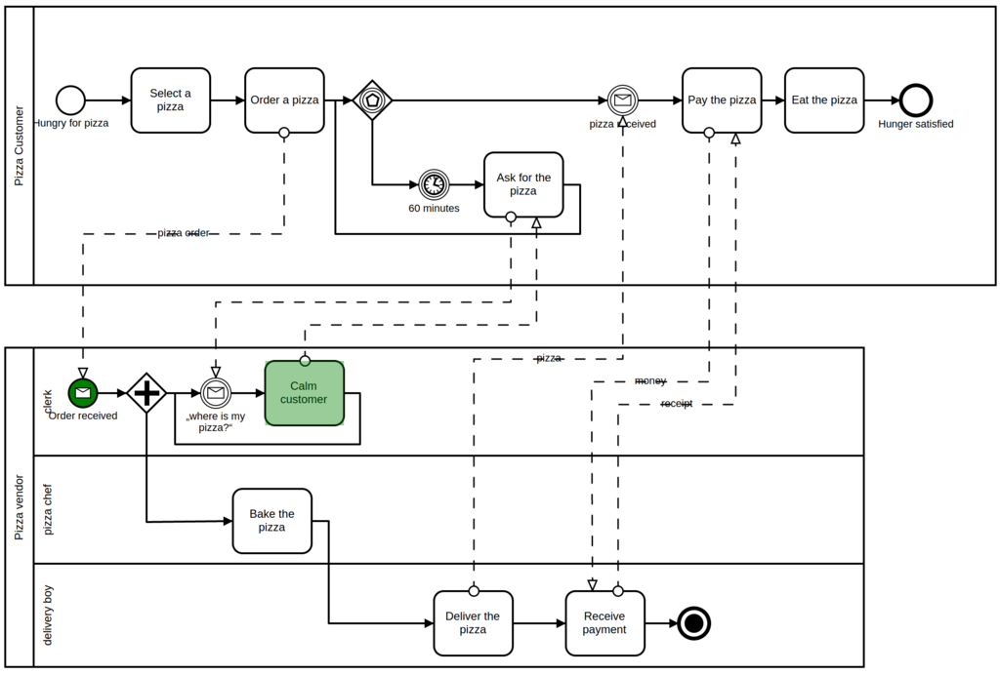

# bpmn-js colors

This example shows how to add colors to BPMN diagrams rendered with [bpmn-js](https://github.com/bpmn-io/bpmn-js).

[__Try out__](https://cdn.staticaly.com/gh/bpmn-io/bpmn-js-examples/master/colors/index.html).


## About

The example shows a number of different approaches how to add colors to your BPMN diagrams.



The following options exist:

* [Color via Overlay](#option-1-color-via-overlay)
* [Color via BPMN 2.0 Extension](#option-2-color-via-bpmn-20-extension)
* [Color via Marker + CSS Styling](#option-3-color-via-marker--css-styling)
* [Color via Custom Renderer](#option-4-color-via-custom-renderer)

See below for details on each of the approaches.


## Usage Summary

Include [bpmn-js](https://github.com/bpmn-io/bpmn-js) and set it up [pre-packaged](../pre-packaged) or [via npm](../bundling):


```javascript
var diagramXML = 'put your BPMN 2.0 process XML here';

var viewer = new BpmnJS({ container: '#diagram' });
```


## Adding Colors

### Option 1: Color via Overlay

> This example assumes you have [jQuery](http://jquery.com/) installed.

Add a CSS snippet like the following to your HTML file:

```css
.highlight-overlay {
  background-color: green; /* color elements as green */
  opacity: 0.4;
  pointer-events: none; /* no pointer events, allows clicking through onto the element */
}
```

Now, attach a highlight overlay with the given class to certain elements:

```javascript
await viewer.importXML(diagramXML);

var overlays = viewer.get('overlays');
var elementRegistry = viewer.get('elementRegistry');

var shape = elementRegistry.get('UserTask_1');

var $overlayHtml =
  $('<div class="highlight-overlay">')
    .css({
      width: shape.width,
      height: shape.height
    });

overlays.add('UserTask_1', {
  position: {
    top: -5,
    left: -5
  },
  html: $overlayHtml
});
```


### Option 2: Color via BPMN 2.0 Extension

If you would like colors to be part of your BPMN 2.0 diagrams you may use our built-in BPMN 2.0 color extension.

To add colors, pick up the modeler and use the `Modeling#setColor` API to assign stroke and fill to BPMN elements:

```javascript
var bpmnModeler = ...;
var modeling = bpmnModeler.get('modeling');

var elementsToColor = [ element1, element2 ];

// setting colors
modeling.setColor(elementsToColor, {
  stroke: 'green',
  fill: 'yellow'
});

// removing previously set colors
modeling.setColor(elementsToColor, null);
```

The colors are persisted in the BPMN 2.0 diagram and shown by the BPMN viewer, too.

Read [this blog post](https://bpmn.io/blog/posts/2016-colors-bpmn-js.html) for more details on this feature.


### Option 3: Color via Marker + CSS Styling

Add a CSS snippet like the following to your HTML file:

```css
.highlight:not(.djs-connection) .djs-visual > :nth-child(1) {
  fill: green !important; /* color elements as green */
}
```

The snippet ensures that elements with the `highlight` class get a SVG fill of `green`.

After import, add the `highlight` class as an element marker to the every element you would like to see colored in green:

```javascript
await viewer.importXML(diagramXML);

var canvas = viewer.get('canvas');

canvas.addMarker('UserTask_1', 'highlight');
```


### Option 4: Color via Custom Renderer

Checkout [bpmn-js-task-priorities](https://github.com/bpmn-io/bpmn-js-task-priorities) for an example that provides a [custom renderer](https://github.com/bpmn-io/bpmn-js-task-priorities/blob/master/lib/priorities/ColorRenderer.js) to color shapes and connections dynamically.


## Run this Example

Download the [example diagram](https://cdn.staticaly.com/gh/bpmn-io/bpmn-js-examples/master/colors/index.html) and open it in a web browser.


## License

MIT
