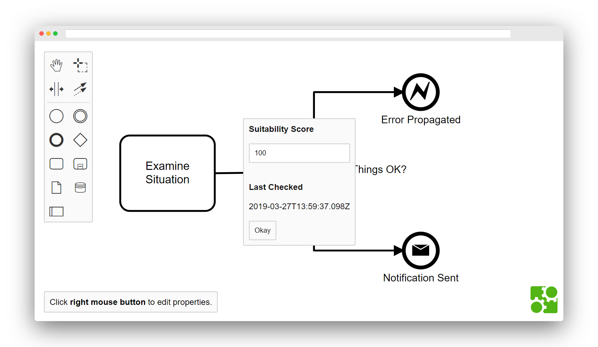
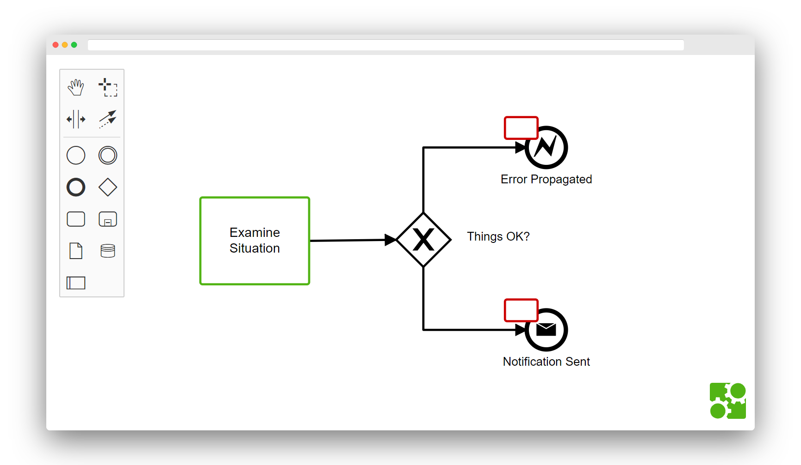
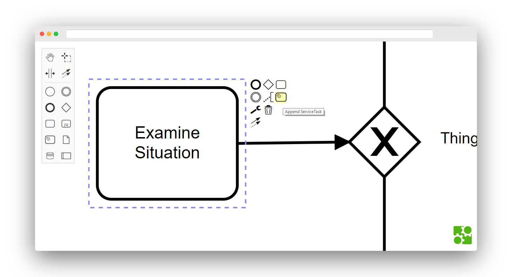
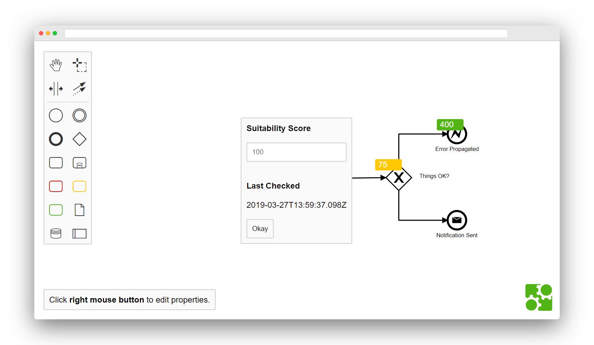

# Custom Elements in bpmn-js

A powerful feature provided by [bpmn-js](https://github.com/bpmn-io/bpmn-js) is the ability to create _custom elements_. Custom elements are ordinary BPMN 2.0 elements with domain-specific data, look, and feel. Use cases for such elements include:

* show certain elements in a distinct way
* restrict rules where a user can place elements on the diagram
* add data related to performance analytics such as KPI targets
* display hidden details directly on the diagram
* attach technical information related to model execution

:warning: If your data has a different life-cycle (for example runtime data) or is stored outside the BPMN 2.0 diagram you should consider alternative extension mechanisms such as [:notebook: overlays](https://github.com/bpmn-io/bpmn-js-examples/tree/main/overlays).

## Implementation Techniques

This page features a number of key techniques to build custom elements:

* [Read custom data from a BPMN 2.0 file](#read-bpmn-20-extensions)
* [Render certain elements differently](#customize-rendering)
* [Create custom editor controls](#customize-editor-controls)

Additional topics, not directly featured here include:

* [Define custom modeling rules](../custom-modeling-rules)
* [Create a properties panel for custom data editing](https://github.com/bpmn-io/bpmn-js-example-react-properties-panel)

## Read BPMN 2.0 Extensions

You can use the BPMN 2.0 extension mechanism to add extension attributes and elements in a BPMN 2.0 compatible way.

You can find an example of this approach in our [model extension example](https://github.com/bpmn-io/bpmn-js-example-model-extension). It creates a model extension that allows you to read, modify and write BPMN 2.0 diagrams that contain extension attributes and elements.

## Customize Rendering

If you want to draw certain BPMN 2.0 elements differently, you can create a custom renderer. Usually, you would want to do this to be able to distinct custom elements from other elements.

There is an example in our [custom rendering example](https://github.com/bpmn-io/bpmn-js-example-custom-rendering). It renders `bpmn:Task` and `bpmn:Event` elements differently.

## Customize Editor Controls

You can add custom controls so that users can create custom elements through palette and context pad.

You can find an example in our [custom controls example](https://github.com/bpmn-io/bpmn-js-example-custom-controls). It adds controls that allow you to create `bpmn:ServiceTask` elements through both, the palette and the context pad.

## Custom Elements, Complete Demo

The [custom elements example](https://github.com/bpmn-io/bpmn-js-example-custom-elements) combines all the techniques showcased in the previous sections. It creates a model extension, custom rendering, and custom controls.

## There Is More

Of course, you can go even further. Have a look at the following examples:

* [Custom rules](https://github.com/bpmn-io/bpmn-js-examples/tree/main/custom-modeling-rules) - Customize diagram modeling rules.
* [Custom properties panel](https://github.com/bpmn-io/bpmn-js-example-react-properties-panel) - Create a properties panel to allow editing of custom data
* [bpmn-js-properties-panel extension](https://github.com/bpmn-io/bpmn-js-examples/tree/main/properties-panel-extension) - Extend our [properties panel](https://github.com/bpmn-io/bpmn-js-properties-panel) to edit custom element properties.
* [Custom shapes](https://github.com/bpmn-io/bpmn-js-example-custom-shapes) - Add any shape to a BPMN 2.0 diagram.

## License

MIT
