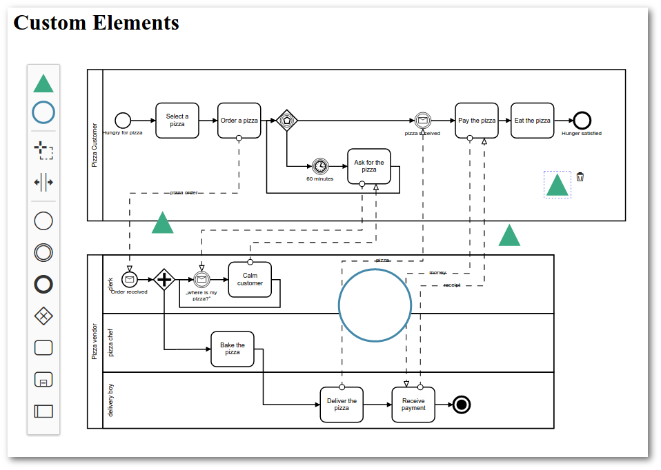

# custom elements

> Advanced example. Works with [bpmn-js](https://github.com/bpmn-io/bpmn-js) version v0.15.

This example shows how to add support for custom shapes and connections to [bpmn-js](https://github.com/bpmn-io/bpmn-js).


## About

This example creates a custom BPMN modeler that can display and add custom shapes and connections to BPMN 2.0 diagrams.

The renderer ships with custom rules that define which modeling operations are possible on custom shapes and connections.
It can import custom shapes and connections from a [JSON](http://json.org/) descriptor and updates their properties during modeling.




## Usage Summary

The example provides a [custom modeler](https://github.com/bpmn-io/bpmn-js-examples/blob/master/custom-elements/app/custom-modeler/index.js). After instantiation, the modeler allows you to add and get custom shapes and connections.

```javascript
// add custom elements
var customElements = [
  {
    type: "custom:triangle",
    id: "CustomTriangle_1",
    x: 300,
    y: 300
  },
  {
    type: "custom:connection",
    id: "CustomConnection_1",
    source: "CustomTriangle_1",
    target: "Task_1",
    waypoints: [
      // ...
    ]
 }
];

customModeler.addCustomElements(customElements);


// get them after modeling
customModeler.getCustomElements(); // all currently existing custom elements
```

The modeler ships with a [module](https://github.com/bpmn-io/bpmn-js-examples/blob/master/custom-elements/app/custom-modeler/custom/index.js) that provides the following [bpmn-js](https://github.com/bpmn-io/bpmn-js) extensions:

* [`CustomPalette`](https://github.com/bpmn-io/bpmn-js-examples/blob/master/custom-elements/app/custom-modeler/custom/CustomPalette.js): A custom palette that allows you to create custom elements
* [`CustomContextPadProvider`](app/custom-modeler/custom/CustomContextPadProvider.js): A custom context pad that allows you to connect custom elements to BPMN elements
* [`CustomElementFactory`](https://github.com/bpmn-io/bpmn-js-examples/blob/master/custom-elements/app/custom-modeler/custom/CustomElementFactory.js): A factory that knows about how to create BPMN and custom shapes
* [`CustomRenderer`](https://github.com/bpmn-io/bpmn-js-examples/blob/master/custom-elements/app/custom-modeler/custom/CustomRenderer.js): A renderer that knows how to draw custom elements
* [`CustomRules`](https://github.com/bpmn-io/bpmn-js-examples/blob/master/custom-elements/app/custom-modeler/custom/CustomRules.js): A rule provider that defines the allowed interaction with custom elements
* [`CustomUpdater`](https://github.com/bpmn-io/bpmn-js-examples/blob/master/custom-elements/app/custom-modeler/custom/CustomUpdater.js): An updater that updates business data while the user interacts with the diagram


## Run this Example

Fetch dependencies:

```
npm install
```

Build example:
```
grunt auto-build
```

Run tests:

```
grunt auto-test
```

## License

MIT
