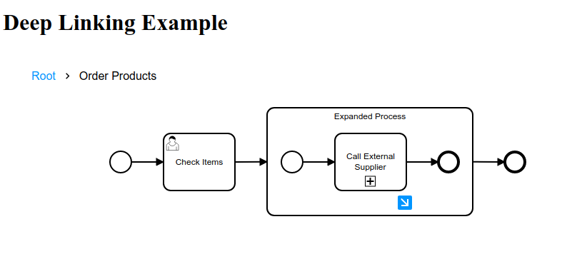

# bpmn-js deep-linking example

This example shows how to use the [rootElements API](https://github.com/bpmn-io/diagram-js/blob/master/lib/core/Canvas.js) of [bpmn-js](https://github.com/bpmn-io/bpmn-js) to switch between different diagram layers.



## About

The example loads a process diagram with nested subprocesses and changes the browser location changing drilling into.
Opening the generated link will take you to the selected subprocess view directly.


## Usage summary

Access the [`Canvas`](https://github.com/bpmn-io/diagram-js/blob/master/lib/core/Canvas.js) service via `bpmnViewer.get('canvas')` and set root elements by id using the `Canvas#setRootElement` method. For collapsed subprocesses, the root element is suffixed with `_plane`.

```javascript
var canvas = bpmnViewer.get('canvas');

// switch to a collapsed subprocess
canvas.setRootElement('collapsedProcess_plane');
```

## Setting up bpmn-js

Grab [bpmn-js](https://github.com/bpmn-io/bpmn-js) [pre-packaged](../pre-packaged) or [via npm](../bundling):

To use `canvas` and other services provided by bpmn-js instantiate bpmn-js (this time the viewer) via

```javascript
var bpmnViewer = new BpmnViewer({
  container: '#canvas',
  width: '100%',
  height: '100%'
});
```

Import a BPMN 2.0 diagram and add the overlays in the `done` callback:

```javascript
await bpmnViewer.importXML(diagramXML);

// retrieve services and work with them
bpmnViewer.get('canvas').setRootElement('...');
```


## Building the Project

Initialize the project dependencies via

```
npm install
```

To create the sample distribution in the `dist` folder run

```
npm run all
```

To bootstrap a development setup that spawns a small webserver and rebuilds your app on changes run

```
npm run dev
```


## License

MIT
