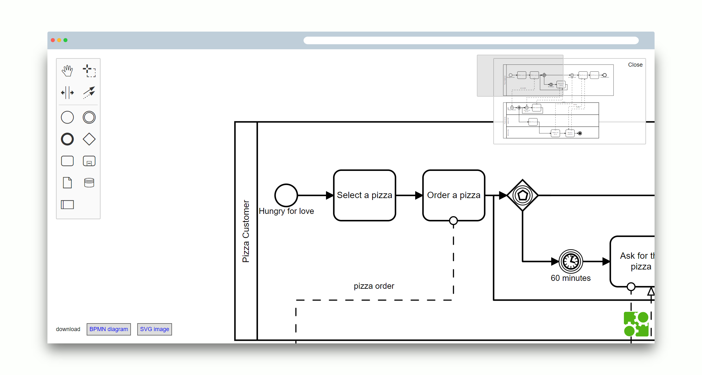

# bpmn-js Minimap Example

This example uses [bpmn-js](https://github.com/bpmn-io/bpmn-js) and [diagram-js-minimap](https://github.com/bpmn-io/diagram-js-minimap). It implements a BPMN 2.0 modeler with a minimap that lets you navigate the diagram.




## Usage

Add [diagram-js-minimap](https://github.com/bpmn-io/diagram-js-minimap) to your project:

```
npm install --save diagram-js-minimap
```

Now load the minimap module along with the [bpmn-js](https://github.com/bpmm-io/bpmn-js) instance:

```javascript
import BpmnModeler from 'bpmn-js/lib/Modeler';

import minimapModule from 'diagram-js-minimap';

var bpmnModeler = new BpmnModeler({
  container: '#canvas',
  additionalModules: [
    minimapModule
  ]
});

bpmnModeler.importXML(xml, function(err) {

  if (err) {
    console.error(err);
  } else {
    console.log('Awesome! Ready to navigate!');
  }
});

```

Checkout [`public/app.js`](public/app.js) for details.


## Building the Example

You need a [NodeJS](http://nodejs.org) development stack with [npm](https://npmjs.org) installed to build the project.

To install all project dependencies execute

```
npm install
```

Build the example execute

```
npm run all
```

You may also spawn a development setup by executing

```
npm run dev
```

Serve the application locally or via a web server (nginx, apache, embedded).
