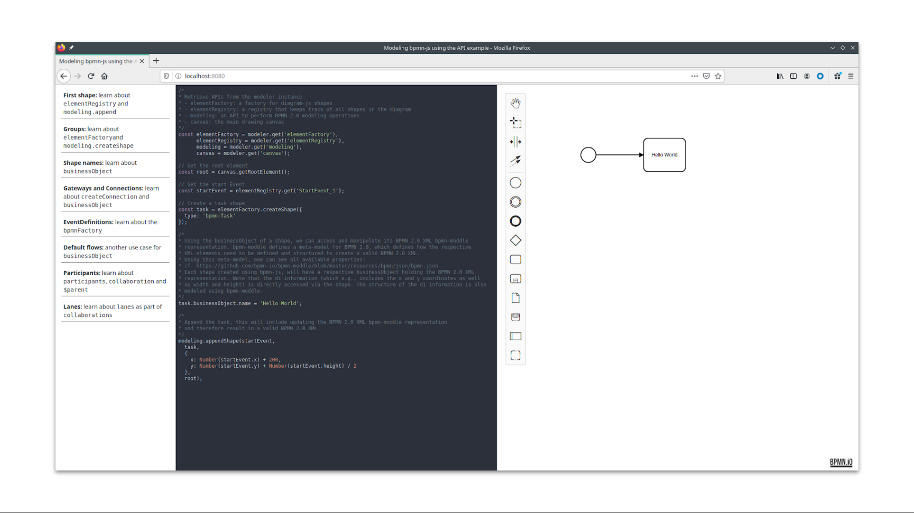

# Modeling in bpmn-js using the API

This example builds a simple learning page to get started with modeling using the [bpmn-js](https://github.com/bpmn-io/bpmn-js) APIs.

## About

The learning page built in this example includes various code snippets which show basic use cases of the modeling APIs. 


### APIs and concepts covered

In particular, the learning page covers:

* `elementRegistry` a registry that keeps track of all shapes in a diagram 
* `elementFactory` a factory for [diagram-js](https://github.com/bpmn-io/diagram-js) shapes
* `bpmnFactory` a factory for [bpmn-moddle](https://github.com/bpmn-io/bpmn-moddle) BPMN 2.0 XML element representations
* `modeling` an API to perform BPMN 2.0 modeling operations

Using the learning page, you should get familiar with the these key APIs and concepts. However, this is not meant to be a full reference by any means. Therefore you are encouraged to use the learning page as a starting point and then continue with the various other resources:

* [Other examples](https://github.com/bpmn-io/bpmn-js-examples)
* [Testing specification](https://github.com/bpmn-io/diagram-js/blob/develop/test/spec/core/ElementRegistrySpec.js) showing more `elementRegistry` methods
* [Testing specification](https://github.com/bpmn-io/bpmn-js/blob/develop/test/spec/features/modeling/ElementFactorySpec.js) showing more `elementFactory` methods
* [Testing specifications](https://github.com/bpmn-io/bpmn-js/tree/develop/test/spec/features/modeling) showing more `modeling` methods

## Running the example

Install all required dependencies:

```
npm install
```

Build and run the project in the browser
```
npm run dev
```

## License

MIT
