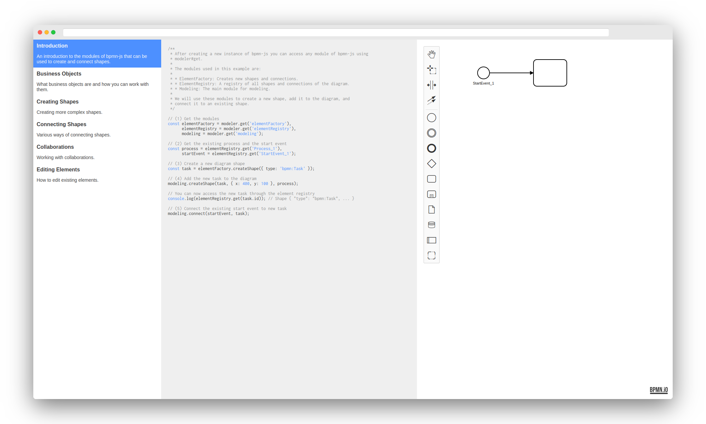

# bpmn-js Example: Modeling Using the Api

A step-by-step introduction to modeling using the API. You'll learn how create and edit shapes and connections.



## About This Example

This example is built as a webpage that introduces you to the basics of working with bpmn-js' API, including:

* creating and editing shapes and connections
* editing the BPMN properties of an element
* creating collaborations, participants and lanes

## Running the Example

Install the dependencies:

```
npm install
```

Build and open the example in the browser:

```
npm start
```

## License

MIT
