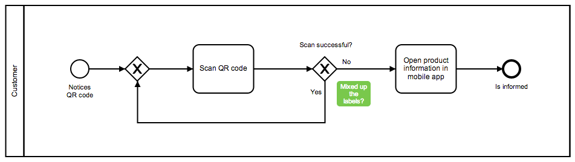

# BPMN Toolkit API: Overlays

This example project explains how to use the Toolkit-API to add HTML overlays to your diagram.

## Code
The process visualizes a typically use case of QR-Codes.



But unfortunately the process author made a mistake.
By using a hypothetical comment feature a reviewer could leave a comment attached to the incorrect element.

Such a comment feature could be realized by using the Overlay-API.
The API needs only string containing valid HTML and the shape the overlay will be attached to.
The API also accepts a jQuery object instead of pure HTML.

```javascript
var element = $('<div>', {
    text: 'Overlay content'
  }).css({
    'background-color': 'rgba(66, 180, 21, 0.7)',
    'color': 'white',
    // ....
  });
element.text = label;

overlays.addOverlay(shape, {
  html: element
});
```

## BPMN initialization

The overlay service is an optional service and therefore it has to be loaded explicitly.

```javascript
var BpmnViewer = require('bpmn-js');
var overlayModule = require('../../../diagram-js/lib/features/overlays');

var bpmnModules = BpmnViewer.prototype._modules.concat([ overlayModule ]);
viewer = new BpmnViewer({ container: '#canvas', modules: bpmnModules});
```


## Setup

Install bpmn-js via [npm](http://npmjs.org).

```
npm install --save bpmn-js
```

## Building the Project

Initialize the project dependencies via

```
npm install
```

The project contains a  [Grunt](http://gruntjs.com/) build script that defines a few tasks.

To create the sample distribution in the `dist` folder run

```
grunt
```

To bootstrap a development setup that spawns a small webserver and rebuilds your app on changes run

```
grunt auto-build
```


## License

``MIT``
