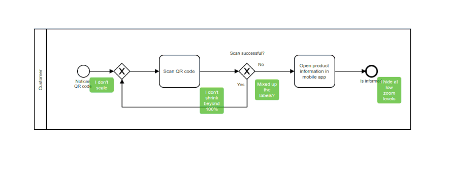

# bpmn-js overlays example

This example shows how to use the [overlays API](https://github.com/bpmn-io/diagram-js/blob/master/lib/features/overlays/Overlays.js) of [bpmn-js](https://github.com/bpmn-io/bpmn-js) to attach HTML overlays to a BPMN 2.0 diagram.


## About

The example loads a process diagram on how to process QR codes and attaches a note on it using the  [`overlays`](https://github.com/bpmn-io/diagram-js/blob/master/lib/features/overlays/Overlays.js) service.




## Usage summary

Access the [`overlays`](https://github.com/bpmn-io/diagram-js/blob/master/lib/features/overlays/Overlays.js) service via `bpmnViewer.get('overlays')` and add overlays to elements by id using the `Overlays#add` method.

```javascript
var overlays = bpmnViewer.get('overlays');

// attach an overlay to a node
overlays.add('SCAN_OK', {
  position: {
    bottom: 0,
    right: 0
  },
  html: '<div>Mixed up the labels?</div>'
});
```

The method `Overlays#add` receives two important parameters:

* a element or elementId
* a overlay descriptor

The overlay descriptor must contain a `html` element you want to attach as the overlay as well as a `position` that indicates where you want the overlay to be added on the element. Use `top`, `left`, `bottom`, `right` to control the attachment.

Checkout [the example](https://github.com/bpmn-io/bpmn-js-examples/blob/master/overlays/app/app.js) for additional configuration options such as conditional scaling and showing of overlays.


### Interacting with Overlays

Instead of adding an HTML string, you can pass a JQuery object or plain DOM element via the overlay descriptor, too. This way you can register events with it, thus making it interactive.

```javascript
var overlayHtml = $('<div>Mixed up the labels?</div>');

overlayHtml.click(function(e) {
  alert('someone clicked me');
});

// attach the overlayHtml to a node
overlays.add('SCAN_OK', {
  position: {
    bottom: 0,
    right: 0
  },
  html: overlayHtml
});
```

### Removing Overlays

Overlays may be removed via `Overlays#remove`, passing the overlay id or a complex element/type selector:

```javascript
// remove by id
var overlayId = overlays.add(...);
overlays.remove(overlayId);

// remove by element and/or type
overlays.remove({ element: 'SCAN_OK' });
```


## Setting up bpmn-js

Grab [bpmn-js](https://github.com/bpmn-io/bpmn-js) [pre-packaged](../pre-packaged) or [via npm](../bundling):

To use `overlays` and other services provided by bpmn-js instantiate bpmn-js (this time the viewer) via

```javascript
var bpmnViewer = new BpmnViewer({
  container: '#canvas',
  width: '100%',
  height: '100%'
});
```

Import a BPMN 2.0 diagram and add the overlays in the `done` callback:

```javascript
await bpmnViewer.importXML(diagramXML);

// retrieve services and work with them
bpmnViewer.get('overlays').add(...);
```


## Building the Project

Initialize the project dependencies via

```
npm install
```

To create the sample distribution in the `dist` folder run

```
npm run all
```

To bootstrap a development setup that spawns a small webserver and rebuilds your app on changes run

```
npm run dev
```


## License

MIT
