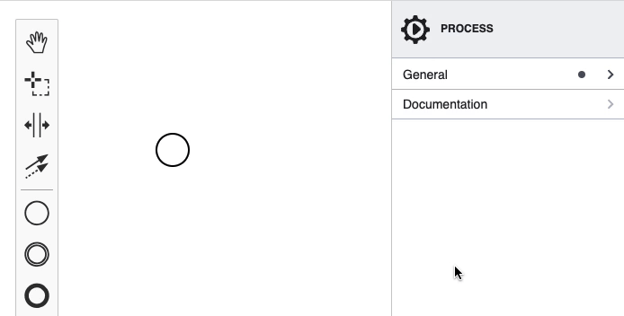

> Extending the properties panel changed significantly with `bpmn-js-properties-panel>=1`. For the `0.x` version of the library, check out [the old version of this example](https://github.com/bpmn-io/bpmn-js-examples/tree/b20919ac2231abf3df45b9dc9a2561010009b4a2/properties-panel-extension).

# Properties Panel Async Extension Example

This example is based on [the properties panel extension example](../properties-panel-extension).
Its goal is to present how the 1.x series of [bpmn-js-properties-panel](https://github.com/bpmn-io/bpmn-js-properties-panel) support asynchronous data loading.

For an advanced async extension example, check out [this repository](https://github.com/bpmn-io/properties-panel-async-example).



## Prerequisites

* You know how to extend the properties panel. Check out [the properties panel extension example](../properties-panel-extension) for guidance.
* You have basic knowledge on [Preact hooks](https://preactjs.com/guide/v10/hooks/).
* You know how to use [the Fetch API](https://developer.mozilla.org/en-US/docs/Web/API/Fetch_API/Using_Fetch).

## About

Most of the code of this example is a copy of [the properties panel extension example](../properties-panel-extension).
Here, we will only refer to what is added on top of that.

In this example, the spells are provided by a simple [express](https://expressjs.com/) server. Source code of the server is located in [server.js](./server.js).

The properties panel extension loads data asynchronously with [the Fetch API](https://developer.mozilla.org/en-US/docs/Web/API/Fetch_API/Using_Fetch). It is made available in the component via [Preact hooks](https://preactjs.com/guide/v10/hooks/).

```javascript
const [ spells, setSpells ] = useState([]);

useEffect(() => {
  function fetchSpells() {
    fetch('http://localhost:1234/spell')
      .then(res => res.json())
      .then(spellbook => setSpells(spellbook))
      .catch(error => console.error(error));
  }

  fetchSpells();
}, [ setSpells ]);

const getOptions = () => {
  return [
    { label: '<none>', value: undefined },
    ...spells.map(spell => ({
      label: spell,
      value: spell
    }))
  ];
}
```

## Running the Example

Install all required dependencies:

```
npm install
```

Build and run the project

```
npm start
```


## License

MIT
