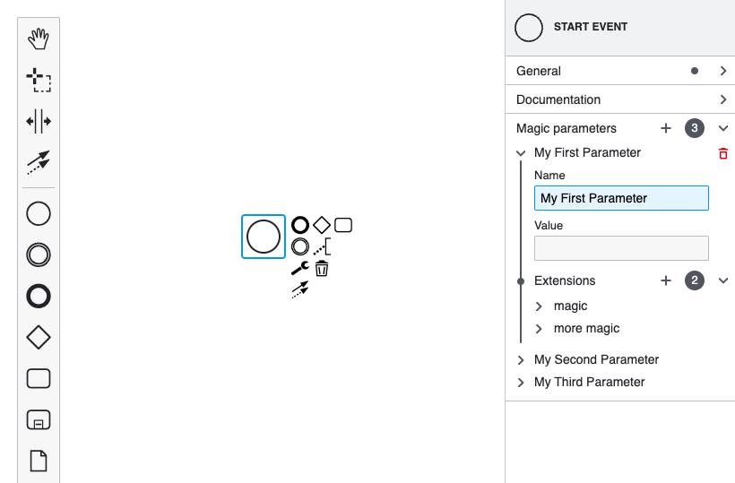

> Extending the properties panel changed significantly with `bpmn-js-properties-panel>=1`. For the `0.x` version of the library, check out [the old version of this example](https://github.com/bpmn-io/bpmn-js-examples/tree/b20919ac2231abf3df45b9dc9a2561010009b4a2/properties-panel-extension).

# Properties Panel List Extension Example

This example is based on [the properties panel extension example](../properties-panel-extension).
Its goal is to present how the 1.x series of [bpmn-js-properties-panel](https://github.com/bpmn-io/bpmn-js-properties-panel) support (nested) list properties.



## Prerequisites

* You know how to extend the properties panel. Check out [the properties panel extension example](../properties-panel-extension) for guidance.


## About

Most of the code of this example is a copy of [the properties panel extension example](../properties-panel-extension).
Here, we will only refer to what is added on top of that.

In this example, we extend the properties panel to allow editing a list of `magic:parameter` elements on all start events. Furthermore, each parameter contains a list of `magic:extension` elements. To achieve that, we will walk through the following steps:

* Add a list group called "Magic parameters" to contain the `magic:parameter` elements
* Add nested list entries to contain the respective `magic:extension` elements
* Create a new moddle extension

The properties will be persisted as an extension as part of the BPMN 2.0 document:

```xml
<bpmn:startEvent id="StartEvent_1">
  <bpmn:extensionElements>
    <magic:parameters>
      <magic:parameter name="Parameter_1" value="magic parameter">
        <magic:extensions>
          <magic:extension key="magic key" />
        </magic:extensions>
      </magic:parameter>
    </magic:parameters>
  </bpmn:extensionElements>
</bpmn:startEvent>
```

The properties panel entries are provided in the following structure.

```
├── ParametersGroup
│   ├── ParameterProps
│       ├── ParameterProps
│           ├── ExtensionList
│               ├── ExtensionProps
```

Let us look into all the important steps in detail.

### Add a List Group

As part of the properties provider, we define the magic parameters group. We use the [`ListGroup`](https://github.com/bpmn-io/properties-panel/blob/main/src/components/ListGroup.js) component here.

```javascript
import parameterProps from './parts/ParameterProps';

import { ListGroup } from '@bpmn-io/properties-panel';

function createParametersGroup(element, injector, translate) {

  const parametersGroup = {
    id: 'parameters',
    label: translate('Magic parameters'),
    component: ListGroup,
    ...parametersProps({ element, injector })
  };

  return parametersGroup;
}
```

The [`ParametersProps`](app/provider/magic/parts/ParametersProps.js) component provides all the entries and the handlers to add and remove new list elements. 

We can provide the focussed input field after creation via `autoFocusEntry` configuration. If not given, the auto-focus behavior is disabled.

```js
function ParametersProps({ element, injector }) {

  const parameters = getParameters(element) || [];

  const bpmnFactory = injector.get('bpmnFactory'),
        commandStack = injector.get('commandStack');

  const items = parameters.map((parameter, index) => {
    const id = element.id + '-parameter-' + index;

    return {
      id,
      label: parameter.get('name') || '',
      entries: ParameterProps({
        idPrefix: id,
        element,
        parameter
      }),
      autoFocusEntry: id + '-name',
      remove: removeFactory({ commandStack, element, parameter })
    };
  });

  return {
    items,
    add: addFactory({ element, bpmnFactory, commandStack })
  };
}

function removeFactory({ commandStack, element, parameter }) {
  return function(event) {
    // ...
  };
}

function addFactory({ element, bpmnFactory, commandStack }) {
  return function(event) {
    // ...
  }
}
```

### Add Nested List Entries

A parameter itself can include nested lists as entries. We use the [`ListEntry`](https://github.com/bpmn-io/properties-panel/blob/main/src/components/entries/List.js) component and define the `magic:extension` elements as representative items, the add and remove handlers. 

```js
import { 
  ListEntry 
} from '@bpmn-io/properties-panel';

function ExtensionList(props) {
  const {
    element,
    idPrefix,
    parameter
  } = props;

  const id = `${ idPrefix }-extensions`;

  const bpmnFactory = useService('bpmnFactory');
  const commandStack = useService('commandStack');
  const translate = useService('translate');

  const businessObject = getBusinessObject(element);

  let extensions = parameter.get('extensions');

  const extensionsList = (extensions && extensions.get('extensions')) || [];

  function addExtension() {
    // ...
  }

  function removeExtension(extension) {
    // ...
  }

  return <ListEntry
    element={ element }
    autoFocusEntry={ `[data-entry-id="${id}-extension-${extensionsList.length - 1}"] input` }
    id={ id }
    label={ translate('Extensions') }
    items={ extensionsList }
    component={ Extension }
    onAdd={ addExtension }
    onRemove={ removeExtension } />;
}
```

In comparison to a list group, a list entry is not configurable on runtime. As an example, each item's entries will be rendered directly in the [`Extension`](app/provider/magic/parts/ExtensionList.js#L104) component and can't be updated via another properties provider. 

### Create a Moddle Extension

Similar to [the basic extension example](../properties-panel-extension), we need to create a moddle extension so that moddle is aware of our new list properties. The extension is a JSON descriptor file [magic.json](app/descriptors/magic.json) containing the necessary definitions:

```javascript
{
  "name": "Magic",
  "prefix": "magic",
  "uri": "http://magic",
  "xml": {
    "tagAlias": "lowerCase"
  },
  "associations": [],
  "types": [
    {
      "name": "Parameters",
      "superClass": [ "Element" ],
      "properties": [
        {
          "name": "values",
          "isMany": true,
          "type": "Parameter"
        }
      ]
    },
    {
      "name": "Parameter",
      "properties": [
        {
          "name": "name",
          "isAttr": true,
          "type": "String"
        },
        {
          "name": "value",
          "isAttr": true,
          "type": "String"
        },
        {
          "name": "extensions",
          "type": "Extensions"
        }
      ]
    },
    {
      "name": "Extensions",
      "superClass": [ "Element" ],
      "properties": [
        {
          "name": "extensions",
          "isMany": true,
          "type": "Extension"
        }
      ]
    },
    {
      "name": "Extension",
      "properties": [
        {
          "name": "key",
          "isAttr": true,
          "type": "String"
        }
      ]
    }
  ]
}
```

### Plugging Everything together

To ship our custom extension with the properties panel we have to wire both the moddle extension and the properties provider when creating the modeler.

```javascript
import BpmnModeler from 'bpmn-js/lib/Modeler';

import {
  BpmnPropertiesPanelModule,
  BpmnPropertiesProviderModule
} from 'bpmn-js-properties-panel';

import MagicPropertiesProviderModule from './provider/magic';
import MagicModdleDescriptor from './descriptors/magic';

const bpmnModeler = new BpmnModeler({
  container: '#js-canvas',
  propertiesPanel: {
    parent: '#js-properties-panel'
  },
  additionalModules: [
    BpmnPropertiesPanelModule,
    BpmnPropertiesProviderModule,
    MagicPropertiesProviderModule
  ],
  moddleExtensions: {
    magic: MagicModdleDescriptor
  }
});
```

## Running the Example

Install all required dependencies:

```
npm install
```

Build and run the project

```
npm start
```


## License

MIT
