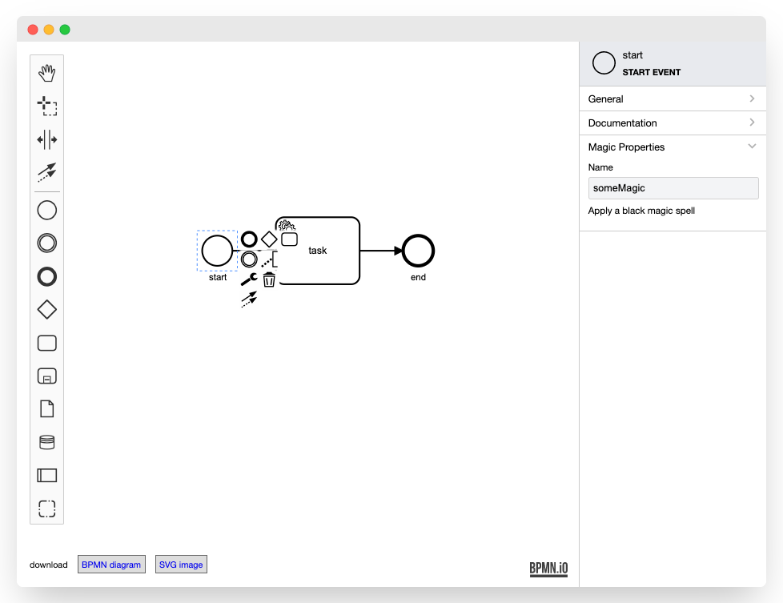

# bpmn-js Modeler + Properties Panel Example

This example uses [bpmn-js](https://github.com/bpmn-io/bpmn-js) and [@bpmn-io/bpmn-properties-panel](https://github.com/bpmn-io/bpmn-properties-panel). It implements a BPMN 2.0 modeler that allows you to edit related properties via a properties panel.



## About

This example is a node-style web application that builds a user interface around the bpmn-js BPMN 2.0 modeler.

## Usage 

...


## Building the Example

You need a [NodeJS](http://nodejs.org) development stack with [npm](https://npmjs.org) and installed to build the project.

To install all project dependencies execute

```
npm install
```

Build the example using [webpack](https://webpack.js.org/) via

```
npm start
```

You may also spawn a development setup by executing

```
npm run dev
```
