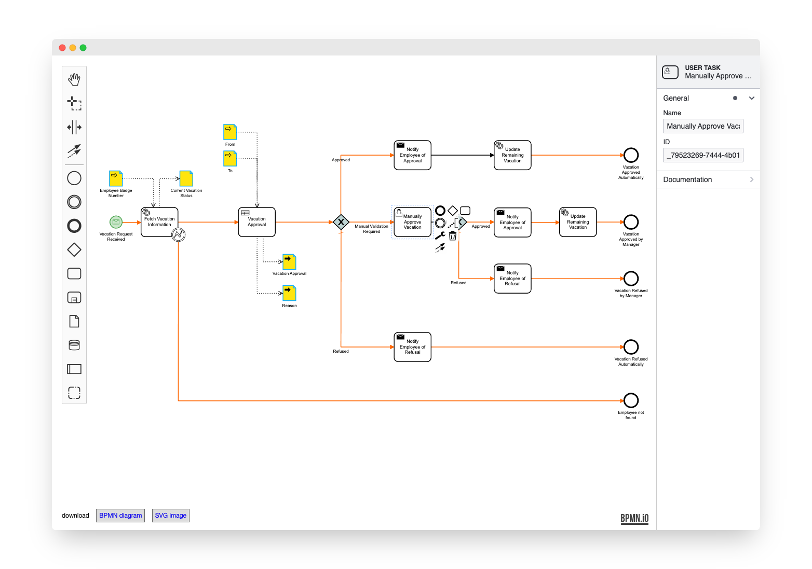

# bpmn-js Modeler + Properties Panel Example

This example uses [bpmn-js](https://github.com/bpmn-io/bpmn-js) and [bpmn-js-properties-panel](https://github.com/bpmn-io/bpmn-js-properties-panel). It implements a BPMN 2.0 modeler that allows you to edit execution related properties via a properties panel.


## About

This example is a node-style web application that builds a user interface around the bpmn-js BPMN 2.0 modeler.




## Usage

Add the [properties panel](https://github.com/bpmn-io/bpmn-js-properties-panel) together with [@bpmn-io/properties-panel](https://github.com/bpmn-io/properties-panel) to your project:

```
npm install --save bpmn-js-properties-panel @bpmn-io/properties-panel
```

Now extend the [bpmn-js](https://github.com/bpmn-io/bpmn-js) modeler with two properties panel related modules, the panel itself and a provider module that controls which properties are visible for each element. Additionally you must pass an element via `propertiesPanel.parent` into which the properties panel will be rendered (cf. [`app/index.js`](https://github.com/bpmn-io/bpmn-js-examples/blob/master/properties-panel/app/index.js#L16) for details).

```javascript
import { BpmnPropertiesPanelModule, BpmnPropertiesProviderModule } from 'bpmn-js-properties-panel';

const bpmnModeler = new BpmnModeler({
  container: '#js-canvas',
  propertiesPanel: {
    parent: '#js-properties-panel'
  },
  additionalModules: [
    BpmnPropertiesPanelModule,
    BpmnPropertiesProviderModule
  ]
});
```

### Camunda Cloud

Additionally, if you'd like to use [Camunda Cloud](https://camunda.com/products/cloud/) execution related properties, include the [zeebe-bpmn-moddle](https://github.com/camunda-cloud/zeebe-bpmn-moddle) dependency which tells the modeler about `zeebe:XXX` extension properties:

```
npm install --save zeebe-bpmn-moddle
```

Then, you need to pass the respective properties provider together with the moddle extension to the modeler:

```javascript
import {
  BpmnPropertiesPanelModule,
  BpmnPropertiesProviderModule,
  ZeebePropertiesProviderModule
} from 'bpmn-js-properties-panel';

import ZeebeBpmnModdle from 'zeebe-bpmn-moddle/resources/zeebe.json'

const bpmnModeler = new BpmnModeler({
  container: '#js-canvas',
  propertiesPanel: {
    parent: '#js-properties-panel'
  },
  additionalModules: [
    BpmnPropertiesPanelModule,
    BpmnPropertiesProviderModule,
    ZeebePropertiesProviderModule
  ],
  moddleExtensions: {
    zeebe: ZeebeBpmnModdle
  }
});
```

### Camunda Platform

If you'd like to use [Camunda Platform](https://camunda.com/products/camunda-platform/) execution related properties, include the [camunda-bpmn-moddle](https://github.com/camunda/camunda-bpmn-moddle) dependency which tells the modeler about `camunda:XXX` extension properties:

```
npm install --save camunda-bpmn-moddle
```

Then, you need to pass the respective properties provider together with the moddle extension to the modeler:

```javascript
import {
  BpmnPropertiesPanelModule,
  BpmnPropertiesProviderModule,
  CamundaPlatformPropertiesProviderModule
} from 'bpmn-js-properties-panel';

import CamundaBpmnModdle from 'camunda-bpmn-moddle/resources/camunda.json'

const bpmnModeler = new BpmnModeler({
  container: '#js-canvas',
  propertiesPanel: {
    parent: '#js-properties-panel'
  },
  additionalModules: [
    BpmnPropertiesPanelModule,
    BpmnPropertiesProviderModule,
    CamundaPlatformPropertiesProviderModule
  ],
  moddleExtensions: {
    camunda: CamundaBpmnModdle
  }
});
```

## Building the Example

You need a [NodeJS](http://nodejs.org) development stack with [npm](https://npmjs.org) and installed to build the project.

To install all project dependencies execute

```
npm install
```

Build the example using [webpack](https://webpack.js.org/) via

```
npm run all
```

You may also spawn a development setup by executing

```
npm run dev
```

Both tasks generate the distribution ready client-side modeler application into the `public` folder.

Serve the application locally or via a web server (nginx, apache, embedded).
