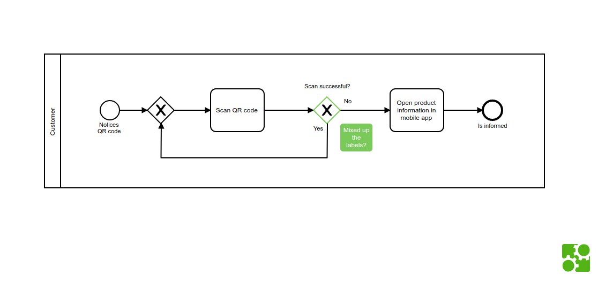

# bpmn-js starter

Try out our toolkit by downloading the [viewer](https://rawgit.com/bpmn-io/bpmn-js-examples/master/starter/viewer.html) or [modeler](https://rawgit.com/bpmn-io/bpmn-js-examples/master/starter/modeler.html) example.

_Screenshot of the [viewer example](https://rawgit.com/bpmn-io/bpmn-js-examples/master/starter/viewer.html)._