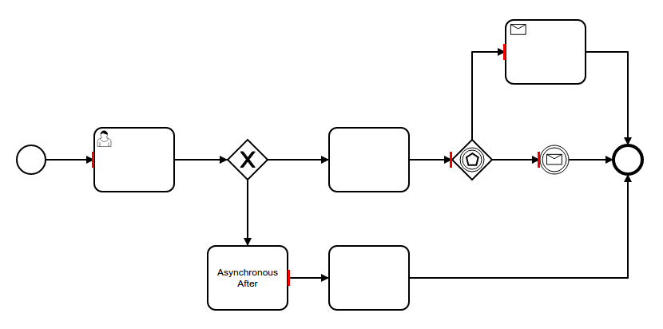

# bpmn-js Transaction Boundaries Example

This example uses [bpmn-js](https://github.com/bpmn-io/bpmn-js) and [bpmn-js-transaction-boundaries](https://github.com/bpmn-io/bpmn-js-transaction-boundaries). It implements a BPMN 2.0 modeler that allows you to visualize transaction boundaries in the diagram.




## Usage

Add [bpmn-js-transaction-boundaries](https://github.com/bpmn-io/bpmn-js-transaction-boundaries) to your project:

```
npm install --save bpmn-js-transaction-boundaries
```

Now extend the [bpmn-js](https://github.com/bpmm-io/bpmn-js) modeler with the transaction boundaries module (cf. [`app/index.js`](app/index.js#L14) for details).

```javascript

var BpmnModeler = require('bpmn-js/lib/Modeler');

var transactionBoundariesModule = require('bpmn-js-transaction-boundaries');

var canvas = $('#js-canvas');

var bpmnModeler = new BpmnModeler({
  container: canvas,
  additionalModules: [
    transactionBoundariesModule
  ]
});

bpmnModeler.importXML(xml, function(err) {

  if (err) {
      console.error(err);
    } else {
      var transactionBoundaries = bpmnModeler.get('transactionBoundaries');

      transactionBoundaries.show();
    }
  });

```


## Building the Example

You need a [NodeJS](http://nodejs.org) development stack with [npm](https://npmjs.org) and [grunt](http://gruntjs.com) installed to build the project.

To install all project dependencies execute

```
npm install
```

Build the example using [browserify](http://browserify.org) via

```
grunt
```

You may also spawn a development setup by executing

```
grunt auto-build
```

Both tasks generate the distribution ready client-side modeler application into the `dist` folder.

Serve the application locally or via a web server (nginx, apache, embedded).
