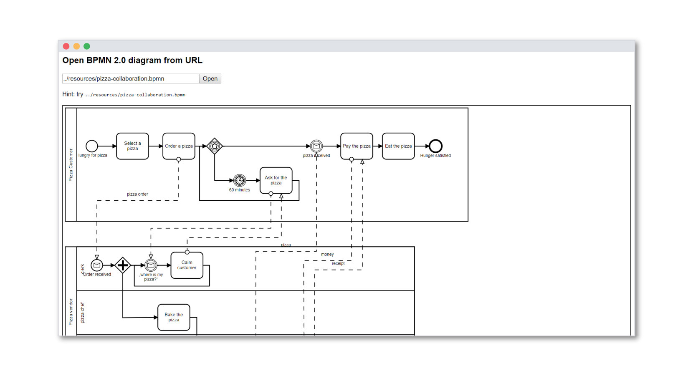

# bpmn-js Url Viewer Example

This example uses [bpmn-js](https://github.com/bpmn-io/bpmn-js) to implement a
simple viewer for BPMN 2.0 process diagrams that can be loaded via their URL.

[__Try out__](https://cdn.staticaly.com/gh/bpmn-io/bpmn-js-examples/master/url-viewer/index.html).

## About

The demo includes the [pre-packaged](../pre-packaged) BPMN viewer.
It allows the user to input a url to fetch a process diagram from.

Make sure you serve the application via a web server (nginx, apache, embedded) and ensure that the diagrams you want to access are either on the same server or [CORS](https://en.wikipedia.org/wiki/Cross-Origin_Resource_Sharing) enabled.

## Run the Example

Download and open the [example HTML page](https://cdn.staticaly.com/gh/bpmn-io/bpmn-js-examples/master/url-viewer/index.html).